  

  <b>High-Throughput Microservices</b> • <b>Platform Resiliency</b> • <b>High-Concurrency Design</b>

---

  
    <i>"I design and build resilient, high-throughput backend services and cloud platforms, optimizing every microsecond of garbage collection, message passing, and cache indexing."</i>
  

 

<table align="center" width="100%" border="0" cellpadding="10" cellspacing="6">
  <tr>
    <!-- Card 1 -->
    <td width="50%" bgcolor="#18181b" style="border: 1px solid #27272a; border-radius: 12px;" valign="top">
      <b>🚀 Distributed Ingress &amp; Scalability</b>
        
      
        Engineering async, non-blocking I/O event loops and ingress gateways designed to handle <b>1M+ daily heartbeat packets</b> and maintain near-zero connection drops under peak-hour traffic.
      
    </td>
    <!-- Card 2 -->
    <td width="50%" bgcolor="#18181b" style="border: 1px solid #27272a; border-radius: 12px;" valign="top">
      <b>⚡ Low-Latency Runtimes</b>
        
      
        Tuning Java virtual machines, profiling threads for locks/contention, and configuring low-latency <b>JVM garbage collection (ZGC)</b> to reduce peak p95 latency bounds by up to <b>35%</b>.
      
    </td>
  </tr>
  <tr>
    <!-- Card 3 -->
    <td width="50%" bgcolor="#18181b" style="border: 1px solid #27272a; border-radius: 12px;" valign="top">
      <b>🗄️ Multi-Tier Cache Fabrics</b>
        
      
        Deploying high-performance dual-tier caching (local Caffeine L1 cache + distributed Redis L2 clusters) to offload system load, reducing database roundtrips by <b>60%</b>.
      
    </td>
    <!-- Card 4 -->
    <td width="50%" bgcolor="#18181b" style="border: 1px solid #27272a; border-radius: 12px;" valign="top">
      <b>🛡️ Infrastructure &amp; Resiliency</b>
        
      
        Configuring containerized pipelines with Docker, orchestrating clusters on Kubernetes, and automating zero-downtime deployments across Google Cloud Platform (GCP) and Azure.
      
    </td>
  </tr>
</table>

  

### 🏗️ Technical Architecture & Topology
*Below represents a typical production-grade microservices topology designed for low-latency event processing:*

  

  

### 🛠️ Core Technology Stack

<table align="center" width="100%" border="0" cellpadding="8" cellspacing="4">
  <tr bgcolor="#18181b">
    <th width="33%">💻 LANGUAGES &amp; RUNTIMES</th>
    <th width="33%">🗄️ STORAGE &amp; CACHE</th>
    <th width="33%">☁️ INFRA &amp; ORCHESTRATION</th>
  </tr>
  <tr bgcolor="#09090b">
    <td align="center" valign="top">
       
        
      
        Java 17 / 21 JVM 
        Spring Boot Ecosystem 
        TypeScript / React / Next.js
      
    </td>
    <td align="center" valign="top">
       
        
      
        PostgreSQL / MySQL Ledger 
        Redis Distributed Clusters 
        Caffeine In-Memory Cache
      
    </td>
    <td align="center" valign="top">
       
        
      
        Docker Containers 
        Kubernetes Orchestration 
        GCP / Azure Cloud Solutions
      
    </td>
  </tr>
</table>

  

### 📥 Connection Channels & Ports

<table align="center" width="100%" border="0" cellpadding="10" cellspacing="6">
  <tr bgcolor="#18181b">
    <td width="50%" align="center" style="border: 1px solid #27272a; border-radius: 8px;">
      <a href="https://github.com/gaxrai" target="_blank" style="text-decoration: none;">
        <b>🌐 GitHub Network</b> 
        github.com/gaxrai
      </a>
    </td>
    <td width="50%" align="center" style="border: 1px solid #27272a; border-radius: 8px;">
      <a href="http://ganeshrai.com/" target="_blank" style="text-decoration: none;">
        <b>💼 Engineering Hub</b> 
        ganeshrai.com
      </a>
    </td>
  </tr>
</table>
