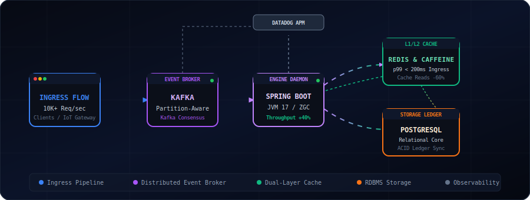

<p align="center">
  
</p>

<p align="center">
  <b>High-Throughput Microservices</b> | <b>Platform Resiliency</b> | <b>Technical Performance Architect</b>
</p>

<p align="center">
  <a href="https://github.com/gaxrai">
    
  </a>
</p>

---

### 🖥️ CLI Status Control Panel
```bash
$ npx gaxrai --diagnostics
```
```yaml
system_diagnostics:
  identity: "gaxrai"
  role: "Software Engineer II"
  specialization: "High-Throughput Microservices & Event-Driven Architecture"
  uptime: "4+ Years Shipping Production Code"
  network_location: "Distributed"
  current_focus: ["JVM GC Diagnostics", "Kafka Event Partitioning", "Latency Hot-Path Refactoring"]
```

---

### 📊 System Performance & Scale Metrics
*Key performance metrics and architectural outcomes delivered across high-scale enterprise environments.*

| 🚀 Scale & Throughput | ⚡ Latency & Performance | 🛡️ Resiliency & Recovery |
| :--- | :--- | :--- |
| **1M+** IoT Devices Monitored | **-35%** Peak-Hour System Latency | **99.999%** Distributed Lock Consistency |
| **10k+** Daily Scheduling Ops | **-25%** p95 API Response Times | **-25%** Team Mean Time to Resolution |
| **200+** Enterprise Data Assets | **-60%** DB Roundtrips (Caffeine) | **48 Hours** Critical Outage Resolved |

---

### 🏗️ Production System Architecture
*A blueprint demonstrating event-driven orchestration, distributed caching, and real-time observability:*

<p align="center">
  
</p>

---

### 🛠️ System Stack & Core Configuration
<p align="center">
  <a href="https://skillicons.dev">
    
  </a>
</p>

```yaml
# configuration.yaml
identity:
  languages: ["Java", "TypeScript", "SQL"]
  frameworks: ["Spring Boot", "Spring MVC", "Hibernate/JPA", "Next.js", "React"]

systems_engineering:
  event_driven: ["Apache Kafka", "Redis Streams"]
  caching_locks: ["Caffeine In-Memory Cache", "Redisson Distributed Locks"]
  datastores: ["PostgreSQL", "MySQL", "Redis Cache", "Active Ledger Core"]
  concurrency: ["Multithreading", "JVM Garbage Collection & Memory Diagnostics", "Thread-Contention Profiling"]

infrastructure_observability:
  cloud: ["Google Cloud Platform (GCP)", "Azure"]
  devops: ["Docker", "Kubernetes (K8s)", "CI/CD (GitHub Actions)", "Systems Design"]
  monitoring: ["Datadog APM", "Grafana Dashboards", "Splunk Log Profiling"]

quality_assurance:
  testing: ["JUnit 5", "Mockito", "Playwright", "Vitest", "Lighthouse Audit"]
```

---

### ⚙️ GitHub Account Diagnostics
<p align="center">
  
  
</p>

<p align="center">
  
</p>

<p align="center">
  
</p>

---

### 💼 Technical Journeys & Operational Impacts

<details open>
  <summary><b>Software Engineer II @ Enterprise Workforce Cloud Platform</b> <i>(04/2025 - Present)</i></summary>
  <br>
  
  *   **Kafka Event-Driven Migrations**: Re-architected a legacy CPU-intensive scheduling system to partition-aware event streams with Apache Kafka on GCP. Reduced peak-hour response times by **35%** across 10k+ daily enterprise requests.
  *   **Kubernetes Heap & JVM Diagnostics**: Led emergency response for critical pod crash loops during Java 17 migration. Audited native memory allocations, analyzed GC logs and heap dumps to resolve native leaks, restoring production stability within **48 hours** and unblocking 5 product teams.
  *   **Hot-Path API Optimization**: Profiling thread-contention issues and re-engineering Spring Boot blocking I/O paths led to a **25%** decrease in p95 latency and a **40%** throughput gain (validated using Datadog APM).
  *   **Caching Strategy**: Implemented Caffeine local cache for critical shift-query endpoints, slashing database load by **60%** and keeping p99 API latencies under **200ms**.
  *   **Mentorship & Observability**: Coached junior engineers on JVM internals and automated unit testing, driving down team MTTR (Mean Time to Resolution) by **25%**.
</details>

<details>
  <summary><b>Software Engineer @ High-Scale Digital Services Provider</b> <i>(07/2022 - 03/2025)</i></summary>
  <br>
  
  *   **IoT Router Telemetry Pipeline**: Built telemetry processing features cataloging diagnostic heartbeats and logs for **1M+** active routers on Azure. Automated diagnostics lowered physical on-site field visits by **25%** and slashed repair costs by **20%**.
  *   **Enterprise Metadata Catalog**: Spearheaded development of an Azure-based Data Dictionary cataloging lineage, schema structures, and ownership for **200+** databases, raising lookup accuracy by **30%** and cutting cross-team database access approval cycles by **40%**.
  *   **Clinical Annotation Consensus**: Designed REST APIs and PostgreSQL schemas on Azure to streamline clinical annotations for 50+ medical annotators, embedding consensus schemas that boosted dataset accuracy by **20%**.
</details>

---

### 🛠️ Core Engineering Blueprints

#### Event-Driven Distributed Task Scheduler
*High-throughput, fault-tolerant distributed dispatch engine processing high-frequency scheduling tasks.*
*   Implemented partition-aware Apache Kafka queues and distributed locking with **Redisson/Redis** to guarantee strictly ordered, double-execution-free task dispatching.
*   *Stack:* `Java`, `Spring Boot`, `Apache Kafka`, `Redis`, `Docker`, `GCP`

#### Real-Time Device Telemetry Aggregator
*High-performance ingestion pipeline processing logs and router diagnostics for 1M+ active network endpoints.*
*   Architected a dual-level cache (**Caffeine** local + **Redis** remote) that dropped DB read traffic by **60%** and enabled automated self-healing triggers.
*   *Stack:* `Java`, `Spring Boot`, `Apache Kafka`, `PostgreSQL`, `Caffeine`, `Azure`

#### High-Throughput Log Pipeline Buffer
*Ingestion buffer throttling sudden telemetry log spikes to guard databases against thread-starvation.*
*   Engineered rate-limiting buffers using **Redis Streams** and thread-pooled batch writers, cutting database write overhead by **40%**.
*   *Stack:* `Java`, `Spring Boot`, `Redis Streams`, `Docker`, `Kubernetes`, `GCP`

---

### 🕹️ Terminal Status Bar / Interactive Ports

```
[F1: GitHub]    ➔ github.com/gaxrai
[F2: Portfolio] ➔ ganeshrai.com
```

<p align="left">
  <a href="https://github.com/gaxrai" target="_blank">
    
  </a>
  <a href="http://ganeshrai.com/" target="_blank">
    
  </a>
</p>
